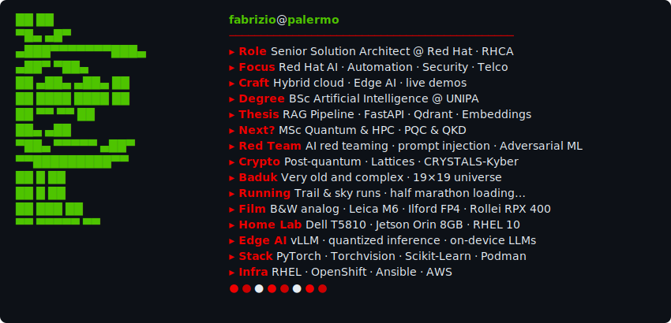

<!-- README.md — commit this + both SVGs to fsoppelsa/fsoppelsa -->

  <picture>
    <source media="(prefers-color-scheme: dark)" srcset="fastfetch-dark.svg">
    <source media="(prefers-color-scheme: light)" srcset="fastfetch-light.svg">
    
  </picture>

  

